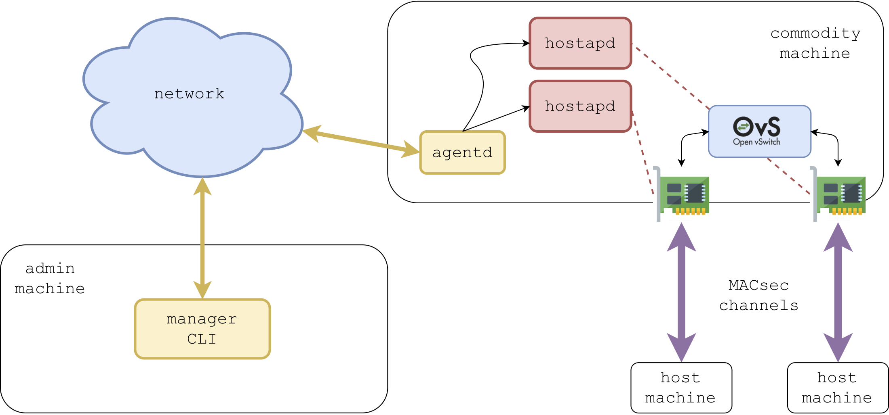

```
                        _  _          _                                                        
         ___ __      __(_)| |_   ___ | |__   _ __ ___    __ _  _ __    __ _   __ _   ___  _ __ 
        / __|\ \ /\ / /| || __| / __|| '_ \ | '_ ` _ \  / _` || '_ \  / _` | / _` | / _ \| '__|
        \__ \ \ V  V / | || |_ | (__ | | | || | | | | || (_| || | | || (_| || (_| ||  __/| |   
        |___/  \_/\_/  |_| \__| \___||_| |_||_| |_| |_| \__,_||_| |_| \__,_| \__, | \___||_|   
                                                                             |___/
```

`switchmanager` is a set of tools that let a system administrator to manage a x64-based layer-2 switch in a distributed environment. It is composed by a manager CLI and by an agent daemon:
- `managercli`: is the CLI that runs into the management server. It is in charge of monitoring all the agent that are deployed in a network and it allows the interaction with them;
- `agentd`: is the daemon that runs into each x64-based layer-2 switch.

## Architecture
<p align="center">
   
</p>

## Install
All these tools have been developed and tested with Ubuntu 16.10 LTS. You can refer to `install.sh` as an automatic installation script of Go, `switchmanager` tools and its dependencies. If you want to perform a manual installation, you might want to read `MANUAL-INSTALL.md`.

### Installation script
An installation script named `install.sh` is available in this repository. If you are going to use it, it performs the following actions:
- install Go toolchain;
- set `GOPATH` environment variable (needed by the Go toolchain) to `$HOME/go`;
- install all the dependencies.

Since the script is going to set environment variable, it has to be executed in the context of the current shell: 
```sh
$ source install.sh
```
### Build
All the binaries will be created inside the `$GOPATH/bin` directory.

#### `managercli` build
```sh
$ cd $GOPATH/src/switchmanager/managercli
$ go install
```

#### `agentd` build
```sh
$ cd $GOPATH/src/switchmanager/agentd
$ go install
```

### hostapd
`hostapd` has to be installed on each switch. Every physical port that is supposed to be part of the switch need an instance of `hostapd` to manage both the 802.1X authentication and the MACsec channel generation. `agentd` is in charge of running and managing all the life process of `hostapd` instances.

## Usage examples
In this section the usage of both `managercli` and `agentd` will be explained.
### `managercli` usage
On the manager machine we have to launch `managercli`:
```sh
$ managercli -config /path/to/config
```
The configuration file is a YAML which structure is composed by the following fields:
```sh
manager_cert: "/path/to/manager/pem"
manager_key: "/path/to/manager/key"
ca_cert: "/path/to/ca/pem"
```
Now we can interact with `managercli` with several commands:
- `list` : lists all the registered agents;
- `run -hostname <agent.hostname>` : runs an instance of `hostapd` on a registered agent;
- `dump -hostname <agent.hostname>` : lists all the instances of `hostapd` of a registered agent;
- `kill -hostname <agent.hostname> -pid <pid>` : kills a specific instance of `hostapd`.

#### Demo
<p align="center">
   
</p>

### `agentd` usage
On the switch machine we have to launch `agentd`:
```sh
$ sudo agentd -config /path/to/config
```
`agentd` must be launched with root permissions because it has to instantiate `hostapd` processes, which need root permissions too.

The configuration file is a YAML which structure is composed by the following fields:
```sh
agent_cert: "/path/to/agent/pem"
agent_key: "/path/to/agent/pem"
ca_cert: "/path/to/ca/pem"
manager_dns_name: "<manager.hostname>"    # DNS name of the managercli
manager_port: "<manager-port>"            # port where the managercli exposes its REST API
agent_dns_name: "<agent.hostname>"        # DNS name of the agetnd
agent_port: "<agent-port>"                # port where the agentd exposes its REST API
openvswitch: "<OpenvSwitch-name>"         # name of the OpenvSwitch switch that has to be managed
interfaces:                               # list of interfaces that have to be attached to the switch
    - name: "<interface-1-name>"
    - name: "<interface-2-name>"
    .
    .
    .
```
